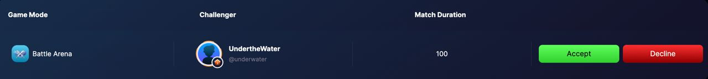

# Battle Arena

Battle Arena - Player vs Player (PVP) mode.
Add and Invite your friends for a trading duel, have your bets ready and prove who has a better trading strategy by winning.

You can choose to click "Quick Match" and be matched with a random user from the platform. Choosing your opponents depends on your matchmaking rate. If you are in the Ape division, then you are most likely be matched with apes.

Go to the "Pending challenger" Tab to see the players who challenged you for a trading battle.

Be careful on using leverage, you might get liquidated and lose the game!
Battle Arena Rules :
Your opponents are determined using Matchmaking Rate.
Each player has a minute and 20 seconds to execute trades and make profit
The player with the highest profit wins the game
Battle Arena is a fun and competitive way of learning and bonding with friends, MTL users and other aspiring traders who you can learn trading with.
Crypto streamers/influencers can use this mode to interact with their followers, or live viewers.
