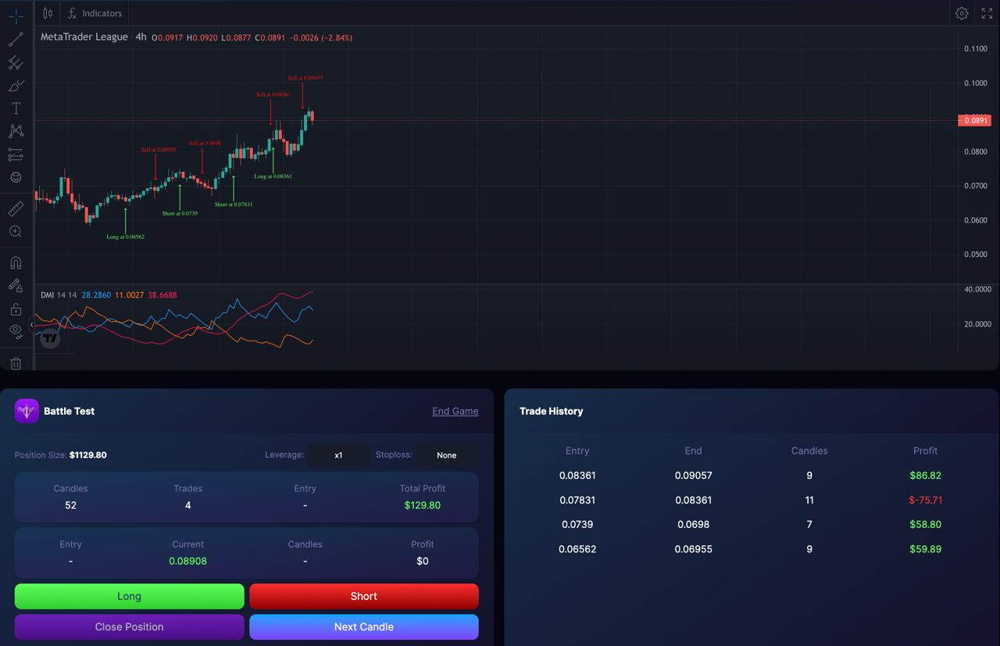

# Battle Test

**Battle Test** - Practice and Battle-test trading strategies in a gamified way, construct the most accurate strategy to profit from the financial market.

A very interactive tooling for composing and practicing trading strategies. Choose from thousands of indicators then try combining tools to construct a strategy you can use to trade the markets, battle with other users and compete in the leaderboards for prizes.
Each game gives a user **100-candles worth of historical data** from a random asset out of thousands of cryptocurrencies. This model proved to be the best way to train strategies for users to master their craft on any given asset and any given market condition.
