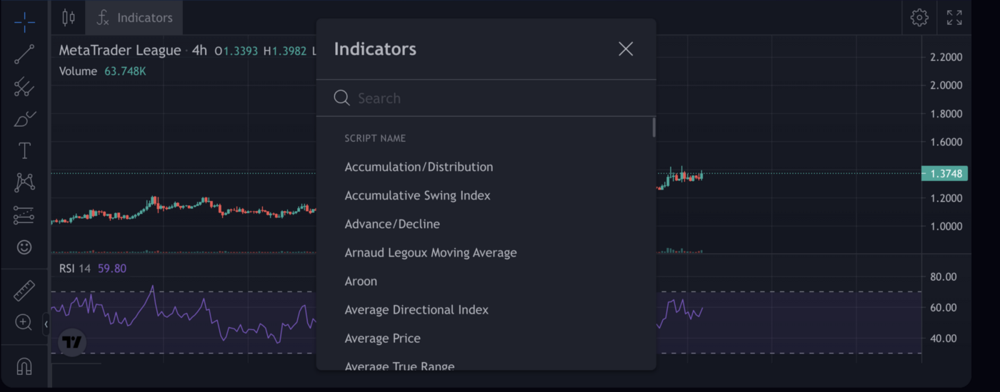
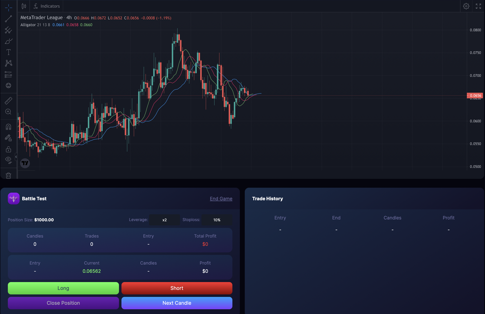
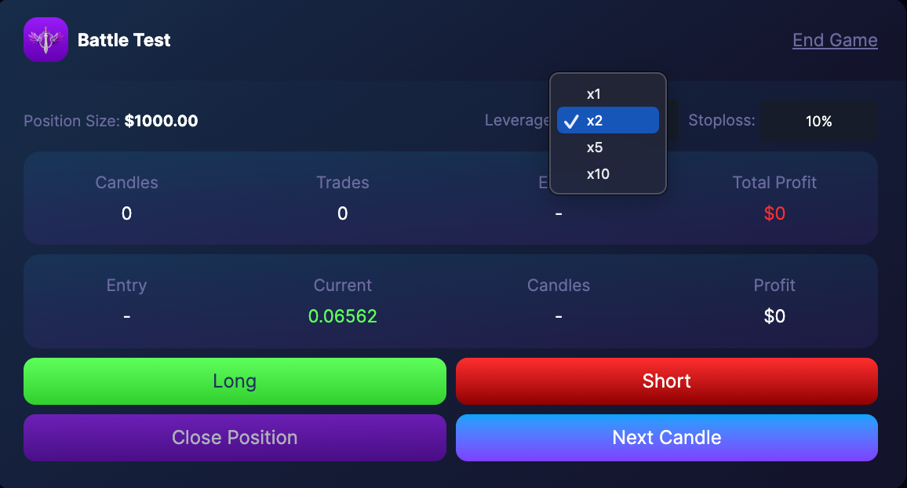
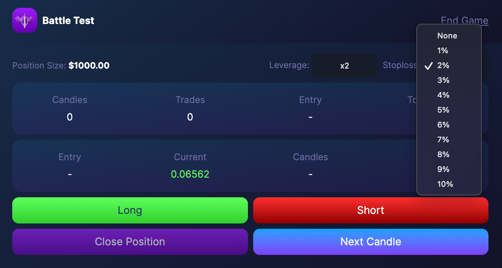
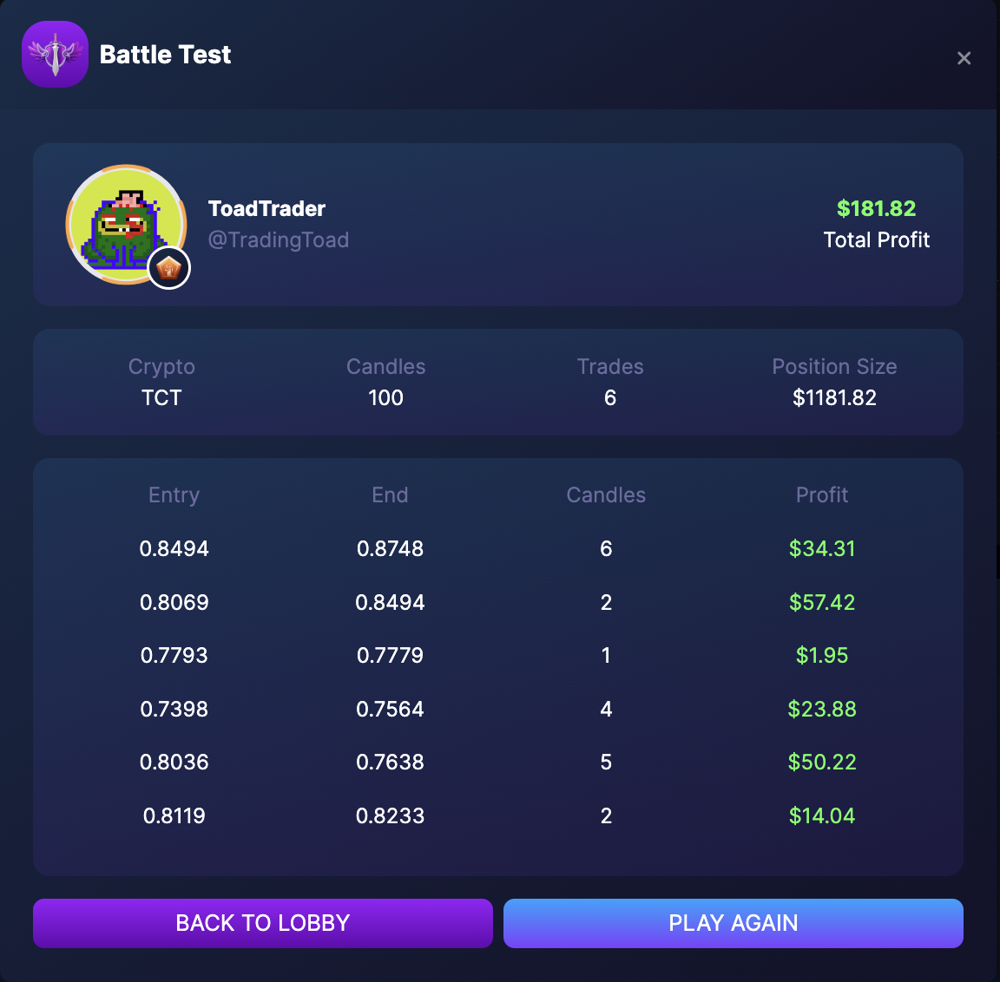

# Gameplay

The game is mainly for technical analysts who use graphs/charts and numerous indicators maximizing historical data to predict the future prices. Choose from thousands of indicators then try combining tools to construct a strategy you can use to trade the markets, battle with other users and compete in the leaderboards to win prizes.

Before you enter a position, make sure to choose the indicators you want to use for your strategy, you can also set your desired level of leverage and stoploss.

- Long - If you think the asset’s price is going up, go Long.
- Short- If you think the asset’s price is going down, go Short.
- Next Candle- To print the next candle, click “Next Day”
- Close Position - To close your current position, click “Close Position”
- Leverage - Increases your position determined by the level of your "Leverage"
- Stoploss - Immediately closes your position to protect you from unwanted losses.

You can choose the level of leverage you want to increase your position. This leverage lets you have a higher exposure than the current capital you have. If you invest $1000 and uses x10 leverage. This gives you a net exposure of $10000. Leverage is a high-risk, high reward play and it is not recommended for beginners.

The most important thing in trading is risk management, cutting losses from bad trades is what will make you a good trader. Setting a stoploss protects you from unwanted losses from unexpected price movements.

To learn more about leverage : https://trading.info/leverage/

At the end of every game, a tab containing the summary of your game will pop up.

MTL gives you the most innovative platform to study, practice and apply your trading strategies to gain profit. A competitive way of learning how to do technical analysis using years of market data.
