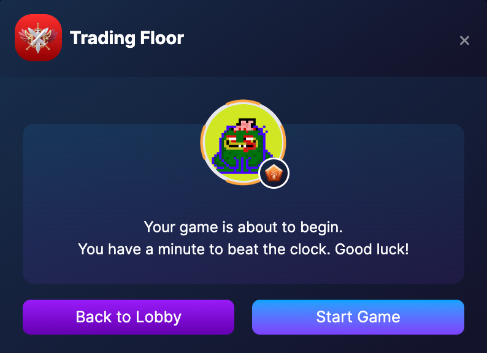
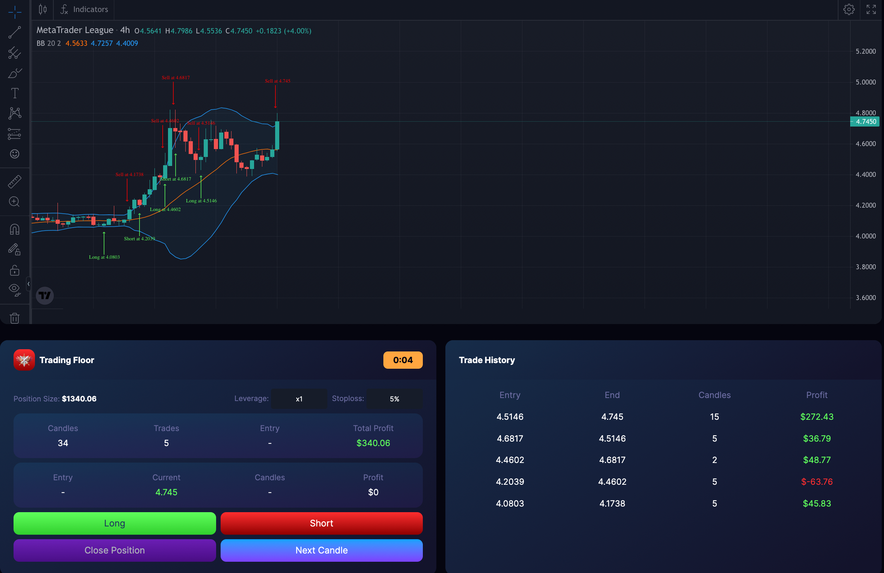
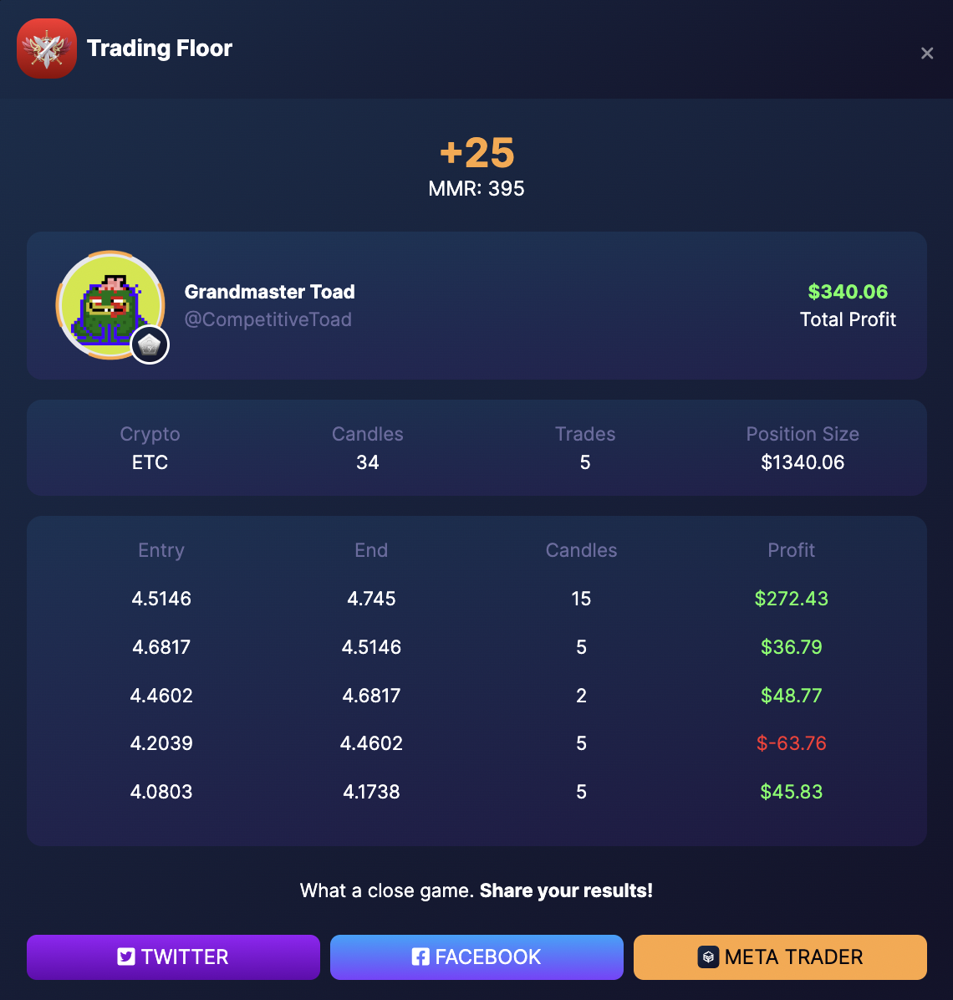

# Ranked Game

Trading Floor - Ranked game
Use the best trading strategies that you were able to construct from battle testing. Apply the strategy using MTL’s trading floor to compete against thousands of traders globally in the leaderboards.

Beat the market in a minute and earn MMR, short for Matchmaking rating on the majority of competitive games. MTL uses this to determine your trading skill level and placing you on higher divisions by achieving a specific range of MMR tiers.

Trading Floor Rules :

- The higher the profits, the higher the MMR earned.
- Reaching above 20% gain gives you +25 MMR
- Gaining 10% - 15% gives you +20 MMR
- A profit of 5% to 10% gives you +10 MMR
- No food and drinks
- No smoking
