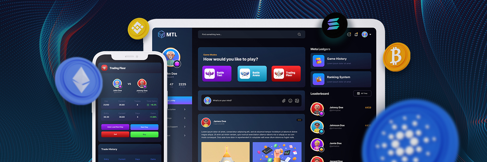

# Introducing TradingLeague

**A gamified learning to trade platform**.

### Overview

With the emergence of blockchain gaming, millions of users around the world were able to interact and dive into the crypto world. This led us to the idea of gamifying the most valuable and most important skill to learn, trading. Cultivating the values of accountability and responsibility is essential for every user interacting with the financial markets.

Trading teaches people how to react with or against the market, which makes them systematic and helps protect their capital against unwanted losses from market movements.

Trading League is equipped with various gamified features about trading, with the goal of onboarding millions of retail users with free access to the most enjoyable, most competitive, and most user-friendly tools for learning how to trade.

### Features

You can use Trading League to:

- :bulb: Study and construct trading strategies
- :moneybag: Practice leverage trading
- :chart_with_upwards_trend: Familiarize yourself with the volatility of crypto
- :video_game: Apply your trading strategies using the game modes
- :sunrise_over_mountains: Become a day trader
- :trophy: Become a competitive trader by topping the leaderboards
- :handshake: Meet both experienced and aspiring traders across the platform
- :tada: Win prizes by joining daily competitions
- :game_die: Organize fun and productive events using MTL tournament mode
- :chart_with_downwards_trend: Monitor and track your trading performance over time
- :star2: Build reputation in the trading world

The sky is the limit.
