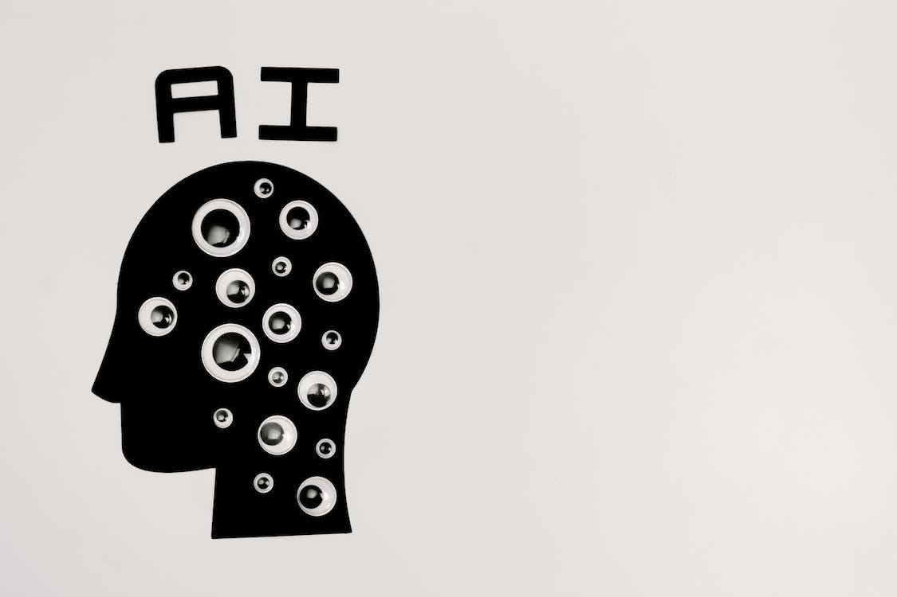
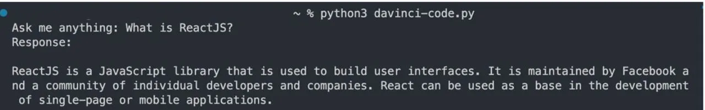

import Link from '@docusaurus/Link';

:::note

- We will be using thecode-davinci-002 model, a free GPT model which is slower than the standard GPT model.

Github : https://github.com/DevgenX/Random-Python-Stuff/blob/main/chatgpt.py

:::

### Python Code

```python
import openai

openai.api_key ='Your API key in here'

model = 'code-davinci-002'
prompt = input('Ask anything: ')


completion = openai.Completion.create(
    engine = model,
    prompt = prompt,
    max_tokens = 120,
    temperature = 0.0,
    n=1,
    stop=["###"],

)


response = completion.choices[0].text
print(response)

```

First, you need to ensure that you have the openai library installed. If you don't have it installed, you can install it by running !pip install openai in your Python environment.

Once done, the next step is getting your API keys <Link to="https://platform.openai.com/overview">here</Link>.

Step by step process :

Create an account if you don’t have one
On the upper right tab, click on ‘Personal’ then go to view API keys
Create your API keys, copy and paste it on the code snippet.
And then you’re good to go!

To run the code, paste the code snippet on your chosen IDE. I used <Link to="https://code.visualstudio.com/">Visual Studio Code</Link> to run the program.



Run: **python3 file_name.py**

The prompt will ask you to enter any input you want to search, in this case I asked the bot to define ReactJS

**Input**: <span style={{"color":"green"}}>What is ReactJS?</span>

**Response** : <span style={{"color":"orange"}}>ReactJS is a JavaScript library that is used to build user interfaces. It is maintained by Facebook and a community of individual developers and companies. React can be used as a base in the development of single-page or mobile applications.</span>

Note : This is a simple tool built on top of ChatGPT-3 and is nowhere good or better than their model.

I’ll be building more random stuff as I progress in my learning to code process.

Hope you learned something!
