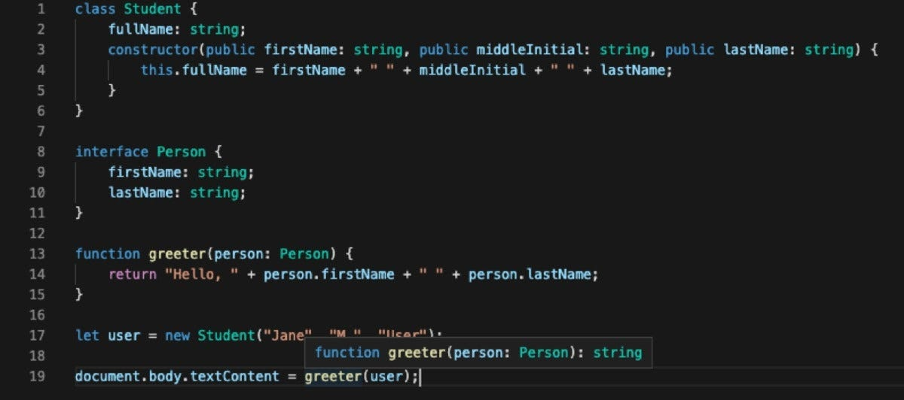

If you’re a developer who’s looking to enhance your JavaScript projects with stronger typing and more robust code, then TypeScript may be just the tool you need. TypeScript is a superset of JavaScript that adds optional static typing, classes, interfaces, and other features to make your code more predictable and easier to maintain. In this guide, we’ll take you through the basics of TypeScript, starting with installing and setting up the TypeScript compiler, and moving on to key concepts like types, functions, interfaces, classes, and modules.

Along the way, we’ll use practical examples to demonstrate how TypeScript can help you catch errors before they become bugs, improve code readability and scalability, and accelerate development workflows. Whether you’re a seasoned JavaScript developer or new to the language, this guide will give you the foundational knowledge you need to start using TypeScript in your projects. Let’s get started!

1. **Typing a function with number as argument**

```typescript
// JavaScript
const addTwoNumbers = (a, b) => {
  return a + b;
};

// TypeScript
const addTwoNumbers = (a: number, b: number) => {
  return a + b;
};
```

The first code snippet is JavaScript, which is a dynamically typed language. It defines a function called addTwoNumbers that takes two arguments, a and b, and returns their sum using the + operator. Because JavaScript is dynamically typed, the types of a and b are not explicitly declared, and can be any type at runtime.

The second code snippet is TypeScript, which is a statically typed language that is a superset of JavaScript. It defines a function called addTwoNumbers that takes two arguments, a and b, both of which are explicitly declared as number types using the : syntax. This means that TypeScript will check at compile time that the types of a and b are indeed numbers, and will flag an error if they are not. By providing type annotations, TypeScript enables developers to catch errors earlier in the development process and write more robust code.

2. **Typing a function with an object as parameters**

```typescript
// JavaScript
const addTwoNumbers = (params) => {
  return params.first + params.second;
};

// TypeScript
interface newParams {
  first: number;
  second: number;
}

const addTwoNumbers = (params: newParams) => {
  return params.first + params.second;
};
```

The JavaScript code defines a function called addTwoNumbers that takes an object params as an argument, and returns the sum of its first and second properties. Since JavaScript is dynamically typed, the params object could have any number of properties and the function would still run.

In the TypeScript code, an interface called newParams is defined, which describes the shape of an object that must have two properties, first and second, both of which must be of type number. This interface is then used to specify the type of the params argument of the addTwoNumbers function, ensuring that only objects with the correct properties and types can be passed in. This makes the code more robust and easier to reason about, as type errors can be caught earlier in the development process.

3. **Typing a function with optional parameters**

```typescript
// JavaScript
const getName = (params) => {
  if (params.last) {
    return `${params.first} ${params.last}`;
  }
  return params.first;
};

// TypeScript
interface getNames {
  first: string;
  last?: string;
}

const getName = (params: getNames) => {
  if (params.last) {
    return `${params.first} ${params.last}`;
  }
  return params.first;
};
```

The JavaScript code defines a function called getName that takes an object params as an argument. If the last property of the params object is defined, the function returns a string that concatenates the first and last properties separated by a space. Otherwise, the function returns just the first property. Because JavaScript is dynamically typed, the function can accept an object with any properties, which makes it flexible but also more error-prone.

In the TypeScript code, an interface called getNames is defined, which describes the shape of an object that must have a required first property of type string and an optional last property of type string. The getName function is then defined to take an argument of type getNames, ensuring that the input object conforms to the expected shape. This makes the code more reliable and easier to understand, as it ensures that the object passed to the function has the required properties with the correct types.

4. **Typing a function with union type**

```typescript
// TypeScript
interface User {
  id: number;
  firstName: string;
  lastName: string;
  role: "admin" | "user" | "super-admin";
}

const defaultUser: User = {
  id: 1,
  firstName: "Seb",
  lastName: "Degen",
  // @ts-expect-error
  role: "I_SHOULD_NOT_BE_ALLOWED",
};
```

In TypeScript, a union type allows a variable to have one of multiple possible types. In the code provided, the role property of the User interface is defined as a union type of "admin", "user", and "super-admin". This means that any variable or parameter that is typed as User can only have one of these three string values for the role property, and any other value will be considered invalid by the TypeScript compiler. The use of a union type provides more strict type checking, which can help catch errors and make the code more robust.

5. **Typing an array**

```typescript
interface User {
  id: number;
  firstName: string;
  lastName: string;
  role: "admin" | "user" | "super-admin";
  posts: Post[]; // We passed-in Post to be the data type (an array of objects)
}

interface Post {
  id: number;
  title: string;
}

const defaultUser: User = {
  id: 1,
  firstName: "Matt",
  lastName: "Pocock",
  role: "admin",
  // Here's the posts array, with id and title keys.
  posts: [
    {
      id: 1,
      title: "How I eat so much cheese",
    },
    {
      id: 2,
      title: "Why I don't eat more vegetables",
    },
  ],
};
```

The code above defines an interface called User which has properties for id, firstName, lastName, and role as well as an array of Post objects called posts. The Post interface has properties for id and title. The defaultUser object is then created based on the User interface, with values assigned to all of its properties including an array of Post objects.

6. **Typing a function that returns a promise**

```typescript
interface LukeSkywalker {
  name: string;
  height: string;
  mass: string;
  hair_color: string;
  skin_color: string;
  eye_color: string;
  birth_year: string;
  gender: string;
}

const fetchLukeSkywalker = async (): Promise<LukeSkywalker> => {
  const data = await fetch("https://swapi.dev/api/people/1").then((res) => {
    return res.json();
  });

  return data;
};
```

This code defines an interface LukeSkywalker which specifies the properties of an object representing Luke Skywalker's personal information. The fetchLukeSkywalker function uses the async/await syntax to retrieve data from the Star Wars API (SWAPI) and return a promise of a LukeSkywalker object. The fetch method returns a promise that is resolved with a Response object, which is then parsed into JSON format and returned as the result of the function.

7. **Typing an object that accepts parameters using Record**

```typescript
const createCache = () => {
  const cache: Record<string, string> = {};

  const add = (id: string, value: string) => {
    cache[id] = value;
  };

  const remove = (id: string) => {
    delete cache[id];
  };

  return {
    cache,
    add,
    remove,
  };
};
// alternative solution
// We use interface and indexing instead of Record
interface Keys {
  [index: string]: string;
}

const createCache = () => {
  const cache: Keys = {};

  const add = (id: string, value: string) => {
    cache[id] = value;
  };

  const remove = (id: string) => {
    delete cache[id];
  };

  return {
    cache,
    add,
    remove,
  };
};
```

In TypeScript, Record is a utility type that allows you to create a type with keys of a specific type and values of another specific type. In this code snippet, createCache is a function that creates a simple cache object with an underlying JavaScript object where keys are strings and values are also strings. The add method allows you to add key-value pairs to the cache, while remove removes a specific key-value pair. The function returns an object with the cache, add, and remove methods that can be used to interact with the cache.

8. **Typing a try/catch block inside a function**

```typescript
const tryCatchDemo = (state: "fail" | "succeed") => {
  try {
    if (state === "fail") {
      throw new Error("Failure!");
    }
  } catch (e) {
    if (e instanceof Error) return e.message;
  }
};
```

This code declares a function named tryCatchDemo that takes in a parameter called state of type "fail" | "succeed". The function tries to execute a block of code, and if it fails, it throws an error with the message "Failure!". In the catch block, it checks if the caught error is an instance of Error, and if it is, it returns the message of the error. The code uses TypeScript to ensure that the state parameter can only have the values "fail" or "succeed", and that the returned value is a string.

9. **Typing a function with omit or pick(only the properties we want)**

```typescript
interface User {
  id: string;
  firstName: string;
  lastName: string;
}

// Here are the two solutions
// Omit excludes id from the properties
type MyType = Omit<User, "id">;
// Picks includes only those that are defined
type MyType = Pick<User, "firstName" | "lastName">;

type tests = [Expect<Equal<MyType, { firstName: string; lastName: string }>>];
```

This code defines an interface called User that has three properties: id, firstName, and lastName. Two new types are then defined using the Omit and Pick utility types provided by TypeScript. Omit is used to create a new type MyType that has all the properties of User except for id. Pick is used to create another type MyType that only has the firstName and lastName properties of User. TypeScript checking is useful here to ensure that the properties being picked or omitted actually exist on the User interface.

10. **Typing a function with a function as an argument**

```typescript
type onFocusFunction = (a: boolean) => void;

const addListener = (onFocusChange: onFocusFunction) => {
  window.addEventListener("focus", () => {
    onFocusChange(true);
  });

  window.addEventListener("blur", () => {
    onFocusChange(false);
  });
};

addListener((isFocused) => {
  console.log({ isFocused });

  type tests = [Expect<Equal<typeof isFocused, boolean>>];
});
```

This code defines a type alias onFocusFunction for a function that takes a single boolean argument and returns nothing (i.e., void). Then, the function addListener is defined that takes an argument of the onFocusFunction type and sets up two event listeners on the window object. When these events are fired (when the window gains or loses focus), the corresponding function passed to addListener is called with the appropriate boolean value, and console.log is called with the same value. The TypeScript compiler checks that the type of isFocused is correctly inferred as boolean.

That’s it for the basics!

There’s so much to learn about TypeScript, but once you dive into the rabbit hole, you can never go back into using JavaScript.

Note : This blog was a summary of what I learned on TypeScript fundamentals.

If you want to learn more, you can view the exercises and solutions in my repository :
